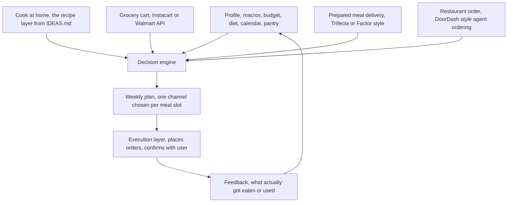

# Zero touch meal automation, an orchestration architecture

This is a different idea from the rest of this project. IDEAS.md is about getting good data into a single optimization run, put in your goals, get back a plan you still have to act on. This doc is about removing the run entirely, a system that takes your goals once and then keeps deciding and acting on your behalf, cooking some days, ordering groceries other days, having a prepared meal show up on the days there is no time to cook, without ever opening an app to plan it.

Nothing here exists as one product yet. Trifecta already delivers macro targeted meals on autopilot once you set a plan. Instacart's Smart Shop and Hungryroot already automate the grocery cart. DoorDash has already opened the door to AI agents placing real orders on a user's behalf. None of them sit above the others and pick the right one week by week, that gap is the actual idea here.

## The core idea

Everything else in this project assumes one fulfillment path at a time, buy ingredients and cook, or order from a restaurant. A true zero touch version has to be channel agnostic. For any given meal slot, the system should be free to choose whichever channel is cheapest and easiest that day, cook something from what is already in the pantry, add to a grocery cart, use a prepared meal that was already scheduled, or place a same day restaurant order, and it should make that choice on its own, on a schedule, not because the user opened the app and asked it to.

## Architecture sketch

## Fulfillment channel adapters

Each channel needs an adapter that turns whatever it offers into the same shape the optimizer already uses, price and macros, plus two fields nothing else in this project needs yet, time cost and lead time.

Cook at home reuses the recipe and pantry layers already sketched in IDEAS.md. Cheapest option by far, costs real prep time, and can be decided the same day.

Grocery cart reuses the shopping list export already sketched in IDEAS.md, through the Instacart and Walmart APIs already described there. Still requires cooking afterward, so this is really cook at home with a delivery step in front of it, not its own separate outcome.

Prepared meal delivery is the fastest path to actual zero effort. Trifecta already sells exactly this, a fixed price around 14 to 16 dollars a meal, known macros, no prep time at all. The tradeoff beyond cost is lead time, these have to be selected days ahead of delivery, not decided the morning of.

Restaurant order is the same day option for whenever nothing else got planned in time. Most expensive per meal, but the only channel with effectively no lead time. This is no longer a hypothetical integration, DoorDash has already shipped a tool that lets an AI agent search stores, apply deals, and check out a real order on a user's behalf, with a public demo of an agent completing a full DoorDash order end to end. The pattern this document depends on, an agent deciding and actually placing a food order, already works today, at least for one retailer.

## Lead time is the real new constraint

This is the one piece nothing else in this project has to deal with. Every other section assumes a decision can be made and acted on the same day. A real orchestration layer has to plan around every channel locking in on a different schedule, a prepared meal box has a cutoff days before delivery, a grocery cart can be adjusted right up until checkout, a restaurant order is same day only. The planner has to run on a rolling basis, deciding the parts of next week that have an early cutoff first, while leaving the same day channels open until closer to the day itself.

## Execution and trust

Deciding a plan and acting on it are different problems. Placing an order or checking out a cart is a real financial action, and getting that wrong, ordering the wrong thing, charging a card without confirmation, spending more than intended, breaks trust immediately in a way a bad meal suggestion does not. The realistic path is a confirm step before anything gets purchased at first, a daily or weekly digest the user approves in one tap, moving toward more autonomy only once there is a track record of the plan being right often enough that checking it stops feeling necessary.

## What already exists and what does not

Delivered meals with genuinely zero ongoing engagement already exist, Trifecta and similar services do this well. Automated grocery carts are actively being built, by Instacart itself through Smart Shop, and independently by Hungryroot. Agent placed restaurant orders already work, at least through DoorDash. What does not exist anywhere found so far is the layer above all of them, deciding week by week which channel is actually right for a given meal given cost, macros, time, and what is already sitting in the pantry, and then acting on that decision without being asked. That gap, not any single channel, is what this document is actually sketching.
