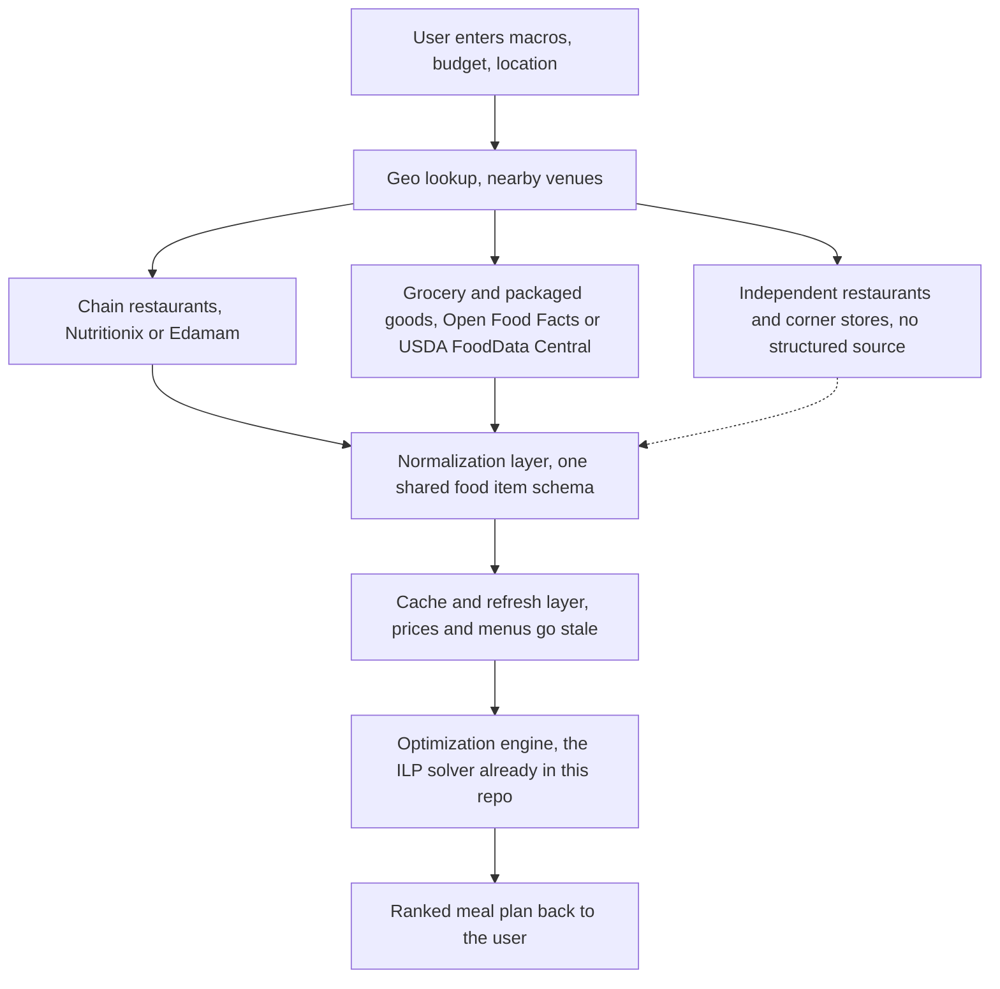

# General Purpose Macro Planner, an open problem

This project started as a narrow tool, optimize a daily meal plan against UCSD's own markets and dining halls. The same idea generalizes well beyond one campus. Put in your macro goals and your location, and get back the cheapest combination of food nearby, restaurants, corner stores, and grocery stores included, that hits your targets.

The optimization side of that is basically solved already. The `run_optimizer` function in this repo is an integer linear program that barely cares whether it's choosing from 45 items or 45,000. What's missing is everything upstream of it, getting real, structured, current price and macro data for arbitrary food sources anywhere.

This doc is a sketch of what that system could look like, and a flag for the hardest unsolved piece in it. Anyone who finds this and wants to take a crack at part of it, go for it.

## The goal

A user opens an app, enters daily macro targets and a budget, and gets a ranked plan built from what's actually available near them right now, chains, independents, and grocery stores together, not just a single curated database like this repo's.

## Architecture sketch

The dotted line into the normalization layer is the point of this doc. That path barely exists today.

### Data layer

Three tiers, in order of how solvable they are.

Chain restaurants are mostly covered already. Nutritionix and Edamam both maintain nutrition databases for large chains, and many chains publish their own nutrition facts directly.

Grocery and packaged goods are also mostly covered. Open Food Facts and USDA FoodData Central have structured macro data for barcoded products, which is most of what a grocery store sells.

Independent restaurants and corner stores are the gap. There is no API for what a specific bodega or a specific taco stand sells today at what price. This is the exact problem this repo already ran into with UCSD's own markets, just multiplied by every independent business in every city. Apps like Instacart solve their version of this with direct data partnerships per retailer, not by scraping, which is a business development effort, not an engineering one, and doesn't scale for a side project.

Live inventory, knowing what's actually on the shelf right now rather than what a menu says, is essentially unsolved even for the chains.

### Normalization layer

Every source returns data in a different shape. This repo already has a food item schema, name, price, calories, protein, carbs, fat, allergens, dietary flags. A general purpose version needs an adapter per data source that maps into that shared schema, plus a source and confidence field so the optimizer and the UI can tell curated chain data apart from something a user typed in themselves.

### Geo lookup

Google Places API or the Yelp Fusion API can answer what's near a given location. Neither one returns macros or reliable prices, so this layer's only job is producing the list of venues to look up in the data layer above.

### Cache and refresh

Restaurant prices and menus change often enough that a naive scrape-on-every-request design would be slow and expensive. A refresh job per venue, on some interval tied to how often that source actually changes, keeps the optimizer working off data that's not too stale.

### Optimization engine

Reuse what's already here. The constraints stay the same, macro floors and a budget ceiling, the only real change at scale is item count, which PuLP and CBC handle fine into the tens of thousands. Beyond that, OR-Tools would be the next step up.

## What's actually feasible to build first

Chains and grocery stores through existing nutrition APIs, filtered to whatever's near the user through Places or Yelp. That alone covers a lot of real eating, most people eat at recognizable chains and shop at recognizable grocery stores more than they eat at unlisted independents.

## The open problem

Independent restaurants and corner stores are where this breaks down, and it's the same problem that led to the outreach effort in this repo's README, there's no clean way to get accurate, current data from a small business without asking that business directly, one at a time. A crowdsourced model, users submitting prices and photos of menus the way MyFitnessPal's food database grew, is the most realistic path, but it needs a moderation and trust layer that doesn't exist yet either.

If you're reading this and have an idea for that piece, or for any piece of this sketch, feel free to fork this repo, open an issue, or just build it. Nothing here is claimed or in progress beyond the UCSD specific version in this repo.
