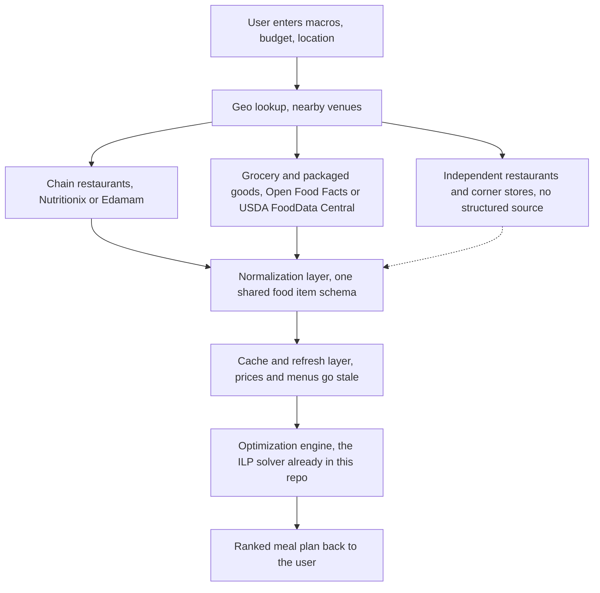
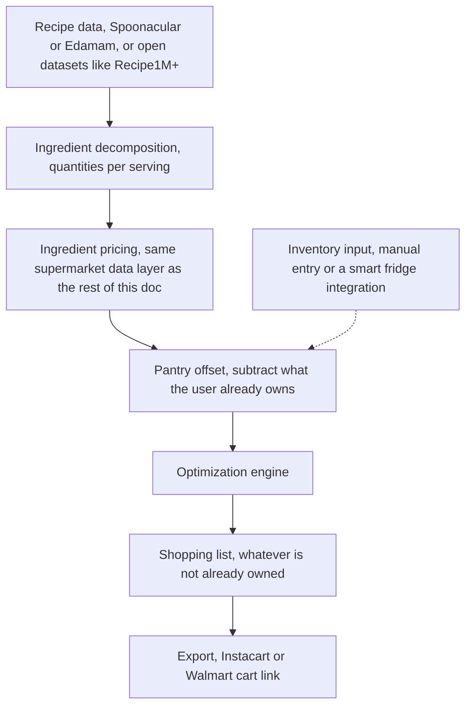
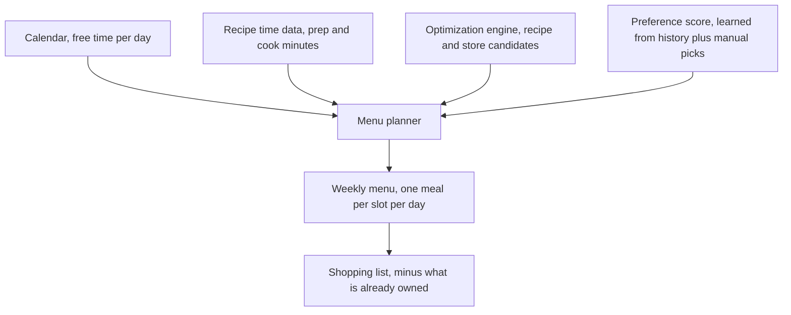

# General Purpose Macro Planner, an open problem

This project started as a narrow tool, optimize a daily meal plan against UCSD's own markets and dining halls. The same idea generalizes well beyond one campus. Put in your macro goals and your location, and get back the cheapest combination of food nearby, restaurants, corner stores, and grocery stores included, that hits your targets.

The optimization side of that is basically solved already. The `run_optimizer` function in this repo is an integer linear program that barely cares whether it's choosing from 45 items or 45,000. What's missing is everything upstream of it, getting real, structured, current price and macro data for arbitrary food sources anywhere.

This doc is a sketch of what that system could look like, and a flag for the hardest unsolved piece in it. Anyone who finds this and wants to take a crack at part of it, go for it.

## The goal

A user opens an app, enters daily macro targets and a budget, and gets a ranked plan built from what's actually available near them right now, chains, independents, and grocery stores together, not just a single curated database like this repo's.

## Architecture sketch

The dotted line into the normalization layer is the point of this doc. That path barely exists today.

### Data layer

Three tiers, in order of how solvable they are.

Chain restaurants are mostly covered already. Nutritionix and Edamam both maintain nutrition databases for large chains, and many chains publish their own nutrition facts directly.

Grocery and packaged goods are also mostly covered. Open Food Facts and USDA FoodData Central have structured macro data for barcoded products, which is most of what a grocery store sells.

Independent restaurants and corner stores are the gap. There is no API for what a specific bodega or a specific taco stand sells today at what price. This is the exact problem this repo already ran into with UCSD's own markets, just multiplied by every independent business in every city. Apps like Instacart solve their version of this with direct data partnerships per retailer, not by scraping, which is a business development effort, not an engineering one, and doesn't scale for a side project.

Live inventory, knowing what's actually on the shelf right now rather than what a menu says, is essentially unsolved even for the chains.

### Normalization layer

Every source returns data in a different shape. This repo already has a food item schema, name, price, calories, protein, carbs, fat, allergens, dietary flags. A general purpose version needs an adapter per data source that maps into that shared schema, plus a source and confidence field so the optimizer and the UI can tell curated chain data apart from something a user typed in themselves.

### Geo lookup

Google Places API or the Yelp Fusion API can answer what's near a given location. Neither one returns macros or reliable prices, so this layer's only job is producing the list of venues to look up in the data layer above.

### Cache and refresh

Restaurant prices and menus change often enough that a naive scrape-on-every-request design would be slow and expensive. A refresh job per venue, on some interval tied to how often that source actually changes, keeps the optimizer working off data that's not too stale.

### Optimization engine

Reuse what's already here. The constraints stay the same, macro floors and a budget ceiling, the only real change at scale is item count, which PuLP and CBC handle fine into the tens of thousands. Beyond that, OR-Tools would be the next step up.

## What's actually feasible to build first

Chains and grocery stores through existing nutrition APIs, filtered to whatever's near the user through Places or Yelp. That alone covers a lot of real eating, most people eat at recognizable chains and shop at recognizable grocery stores more than they eat at unlisted independents.

## Recipe layer, cooking your own meals

Everything above treats a meal as something already made, a burger from a chain, a burrito from Goody's. The optimizer could also consider recipes, buy raw ingredients and assemble them into a meal, which usually beats eating out on macros per dollar.

Mechanically this fits the existing model well. A recipe with a known ingredient list and a known yield reduces to the same shape as any other row in the food database, sum each ingredient's price and macros scaled to the quantity used, divide by servings. `run_optimizer` does not need to change, it just gets one more candidate item.

### Ingredient decomposition and pricing

Recipe data with macros already computed exists. Spoonacular has 5,000 plus recipes with nutrition per serving already worked out, plus an endpoint that estimates recipe cost from ingredient prices directly ([source](https://spoonacular.com/food-api/pricing)). Edamam's Nutrition Analysis API takes a free text ingredient list and extracts calories, protein, carbs, fat, and 24 other nutrients through NLP, tagged with diet and allergy labels that map onto this project's existing FILTERS dict almost directly ([source](https://www.edamam.com/)). Open datasets like Recipe1M+ and RecipeNLG have over one million and 2.6 million recipes respectively but no computed macros, so using them means parsing ingredient lines into quantities and matching them to a nutrition database, the same job described in the LLM text entry section below.

Pricing those ingredients is a harder version of the grocery data problem already described in this doc, not an easier one. Packaged goods have barcodes and show up in Open Food Facts. Raw ingredients, a pound of chicken breast, a cup of rice, a single onion, mostly do not, grocery stores track produce and bulk items by PLU code instead of the structured product data that packaged goods databases index. The most promising path here is not a nutrition database at all, it is going straight to the retailer. Both Walmart and Instacart expose product and pricing APIs built for exactly this, see the shopping list section below, and because they are the retailers themselves rather than a third party nutrition site, they have real prices for both branded and commodity ingredients.

### Inventory and pantry awareness

A recipe's real cost to a given user is not its full ingredient price, it is whatever they still need to buy. If someone already has rice in the pantry, a recipe that uses rice should be priced without it. That turns each recipe's cost into a marginal cost against a maintained inventory rather than a fixed price, which changes the model from a one shot optimization into something that carries state across a planning window.

This does not need to be complicated to be useful. A first version is just a manual list, what is in your kitchen right now and how much, that the optimizer treats as free up to the quantity owned. It is also worth noting this naturally opens the door to a food waste objective almost for free, once inventory items carry a quantity and something like an expiration estimate, the optimizer can be nudged to prefer recipes that use up what is about to go bad before it spoils, on top of the cost and macro goals it already optimizes for.

### Smart fridge integration

This is the least mature piece in this document, worth flagging honestly rather than overselling. A smart fridge is one natural way to populate the inventory layer above without manual entry. Samsung's SmartThings platform has a real, documented developer API, OAuth 2.0, RESTful, hundreds of millions of registered users ([source](https://developer.smartthings.com/docs/home-api/get-started-with-home-api)), but there is no confirmed evidence of food item level inventory data, what is actually inside the fridge, being exposed through it today, as opposed to device state like temperature or door open events. Treat this as a future adapter into the same inventory data structure described above, one more way to fill it in, not something to build against right now.

## Shopping list export

Once the optimizer picks a plan, whatever ingredients are not already covered by inventory is just a list of items and quantities, and both major retailers already have APIs built for exactly this handoff. Instacart's Create Recipe Page API takes an ingredient list and returns a link to a shoppable page, a user opens it, picks a store, and checks out, and it already has a built in concept of ingredients the customer may already have that they can exclude from the cart, which lines up with the pantry idea above almost exactly ([source](https://docs.instacart.com/developer_platform_api/guide/tutorials/create_a_recipe_page)). Walmart's Recipes and Bundle APIs plus its AddToCart service do the equivalent for Walmart ([source](https://walmart.io/apirefservices)).

This is probably the single most immediately buildable piece in this whole document. The retailers already built the plumbing, it is mostly a matter of formatting the optimizer's output to match what their APIs expect.

## Menu planner

Everything above picks food for a single day in isolation. A menu planner extends that into an actual weekly menu, built from the same macro targets, budget, and inventory, but now also aware of when the user has time to cook and what they actually like eating.

### Schedule aware planning, adding time to the database

Assigning a specific recipe to a specific day means that recipe has to actually fit in the time the user has that day. That needs two new inputs this project's schema does not have yet.

The recipe side is the easy part. Most recipe APIs already carry timing, Spoonacular returns readyInMinutes, cookingMinutes, and preparationMinutes on every recipe it serves ([source](https://spoonacular.com/food-api/docs)), so this is less a new data acquisition problem and more a matter of actually carrying that field through into this project's own food schema, which today only has price and macros per item.

The calendar side needs a bit more work. Google Calendar's freebusy.query returns busy intervals for a given calendar and time range, not open slots, there is no endpoint that hands back available time directly ([source](https://developers.google.com/workspace/calendar/api/v3/reference/freebusy/query)). Getting a usable amount of free cooking time per day means subtracting those busy blocks from an active hours window on the backend, a standard pattern, just not a free one.

Once every recipe carries a time cost and every day carries a time budget, the planner picks up one more constraint per day, the total time of everything assigned to that day has to fit inside that day's free time, alongside the macro floors and budget ceiling already in place. That is a real scheduling problem sitting on top of the existing ILP, assigning specific items to specific days rather than choosing a single day's combination, not just a bigger version of what is already here.

### Learning preferences from history

Worth naming honestly, the optimizer as it exists today is purely cost driven, and its literal optimum tends to be the same handful of protein per dollar items over and over, a tuna packet and a banana are mathematically correct and not something anyone wants to eat daily for a month. A menu planner needs some notion of what the user actually likes, not just what is cheapest.

Two standard techniques cover this. Content based similarity represents each meal as a feature vector, ingredients, cuisine, macro ratios, now also prep time, and uses something like cosine similarity to surface recipes similar to ones the user has chosen before. Frequency weighting is simpler, a count or a recency weighted score of how often something has actually been picked. Both feed into the same number, a preference score per candidate item.

That score plugs directly into the optimizer's existing objective. Right now it minimizes cost. With a preference score added it minimizes cost minus a preference weighted bonus, still a linear objective, still solvable by the same PuLP and CBC setup already in this repo, just with one more term.

This piece also has a real dependency worth naming, it needs a history to learn from, which means the app has to actually be used over time and log what gets picked. A single run notebook like this one has no memory between runs, so this is a feature for the app version of this idea, not something that bolts onto the notebook as it exists today.

### Recipe variation, guarding against centralization

Worth calling out as its own requirement rather than a footnote. This is not only a risk for the learned recommender above, it is already true of the notebook exactly as it exists today. A pure cost minimizing ILP has no reason to ever change its answer, given the same database and the same goals it will pick the same handful of protein per dollar items every single run, a tuna packet and a banana are the mathematically correct choice today and will still be the mathematically correct choice in a year. Add a learned preference score on top and the risk gets worse rather than better, frequency weighting left alone just reinforces whatever was already repeated, so the model can end up more confident about the same three meals rather than less.

The fix has to be built into the objective itself, not left as something the user is expected to override by hand. A recency penalty on repeated items, or a hard cap on how many times something can appear inside a rolling window, keeps the optimizer from settling into a fixed rotation the way a purely greedy version would. This also connects directly to the manually preferred recipes idea above and to the recipe layer earlier in this doc, a bigger, more varied recipe database is itself a form of guardrail, the more genuinely different options that score close to optimal, the less any single one of them dominates every plan.

### Manually preferred recipes

The simplest of the three. A way to pin specific recipes so the planner always considers them, either as a soft preference or as a hard requirement for a specific day regardless of whether it is the cost optimal choice that day. This does not need its own mechanism, a manually set preference is just another source feeding the same preference score described above, a user set weight standing in for a learned one.

## The open problem

Independent restaurants and corner stores are where this breaks down, and it's the same problem that led to the outreach effort in this repo's README, there's no clean way to get accurate, current data from a small business without asking that business directly, one at a time. A crowdsourced model, users submitting prices and photos of menus the way MyFitnessPal's food database grew, is the most realistic path, but it needs a moderation and trust layer that doesn't exist yet either.

### A possible way in, LLM assisted text entry

Photo based macro estimation is not accurate enough to build a data pipeline on. A 2025 study testing GPT-4o, Claude 3.5 Sonnet, and Gemini 1.5 Pro on standardized food photos found about 36 to 37% mean error on portion weight, and protein estimation alone exceeded 60% error ([source](https://www.sciencedirect.com/science/article/pii/S2475299125030185)). Purpose built computer vision models with depth sensing do better, Google's Nutrition5k work reports 13 to 19% error on calories ([source](https://www.researchgate.net/publication/355882772_Nutrition5k_Towards_Automatic_Nutritional_Understanding_of_Generic_Food)), still too rough for a budget constrained optimizer. Real products land in the same place, MyFitnessPal's own Meal Scan identifies the right food about 71% of the time and drops to 58% on non American cuisine ([source](https://ai-food-tracker.com/reviews/myfitnesspal/)), and Cal AI does well on simple visible foods, 85 to 92%, but struggles once oil, sauce, or mixed ingredients enter the picture ([source](https://www.getkalohealth.com/blog/is-cal-ai-accurate)).

Nearly all of that error comes from guessing portion size off a 2D image. Text sidesteps it entirely. Someone types what a store sells and at what price instead of photographing it, and an LLM's job shrinks to matching the phrase to a database entry and reading off the stated quantity, a task LLMs already handle well. That reframing is a real candidate for the corner store and independent restaurant gap above, a lightweight text submission flow parsed and matched by an LLM could be the crowdsourced intake layer this problem needs, the same MyFitnessPal style growth path, just with LLM assisted matching in place of a manual search UI.

If you're reading this and have an idea for that piece, or for any piece of this sketch, feel free to fork this repo, open an issue, or just build it. Nothing here is claimed or in progress beyond the UCSD specific version in this repo.
