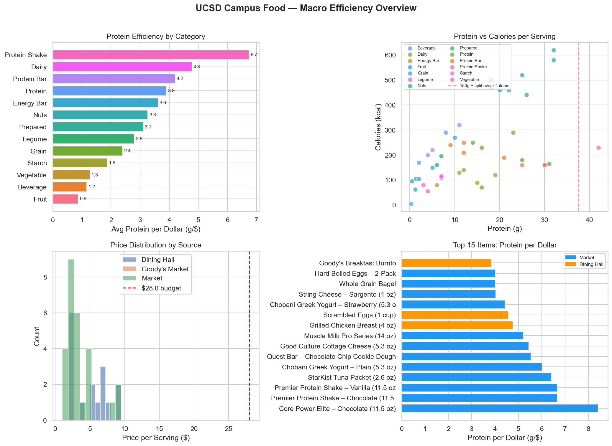

# UCSD Macro Optimizer

A constrained optimization tool that finds the cheapest combination of on campus food that hits a set of daily nutrition targets, calories, protein, carbs, and fat, within a UCSD dining dollar budget.

## What it does

The notebook models grocery and dining hall choices as an integer linear program (PuLP/CBC). Given a set of macro goals and a daily budget, it picks the combination of servings that minimizes total spend while meeting every macro floor. If no combination can meet every goal within budget, it falls back to a soft constraint version that gets as close as possible and reports which goals to relax.

## Data sources

- A curated database of items sold at UCSD's campus markets (Goody's, Sixth Market, Seventh Market, Sunshine Market)
- A curated database of UCSD HDH dining hall a la carte items
- A live scraper that pulls current nutrition facts from UCSD's public dining portal

## Data accuracy

The market item prices and macros in this notebook are hand entered estimates from the 2024-25 school year, not official data, and they are known to be inaccurate in places. I'm currently in contact with UCSD Housing, Dining and Hospitality to get real inventory and pricing data for Goody's, Sixth Market, Seventh Market, and Sunshine Market. Once that data comes through, it will replace the curated estimates so results reflect what's actually on the shelves.

## Setup

```bash
pip install -r requirements.txt
jupyter notebook ucsd_macro_optimizer.ipynb
```

## Notebook sections

1. Configuration. Set your own macro goals, budget, and dietary filters.
2. Food database. Market items, dining hall items, and the live scraper.
3. Combined food dataframe.
4. Exploratory analysis.
5. Optimization engine.
6. Run the optimization.
7. Optimal daily meal plan.
8. Results visualization.
9. Comparison against a current diet.
10. Dietary restriction analysis (vegetarian, vegan, halal, gluten free, no pork).
11. Budget sweep sensitivity analysis.
12. Achievable goal targets for a fixed budget.
13. Add or update food items.
14. Summary and recommendations.

## Beyond UCSD

This notebook is scoped to one campus, but the same idea works anywhere, macros and location in, an optimized plan across restaurants, corner stores, and grocery stores out. [IDEAS.md](IDEAS.md) sketches what that would take and flags the parts that are still an open problem. Anyone who wants to pick up a piece of it is welcome to.

## Preview



Claude was used in the development of this project.
